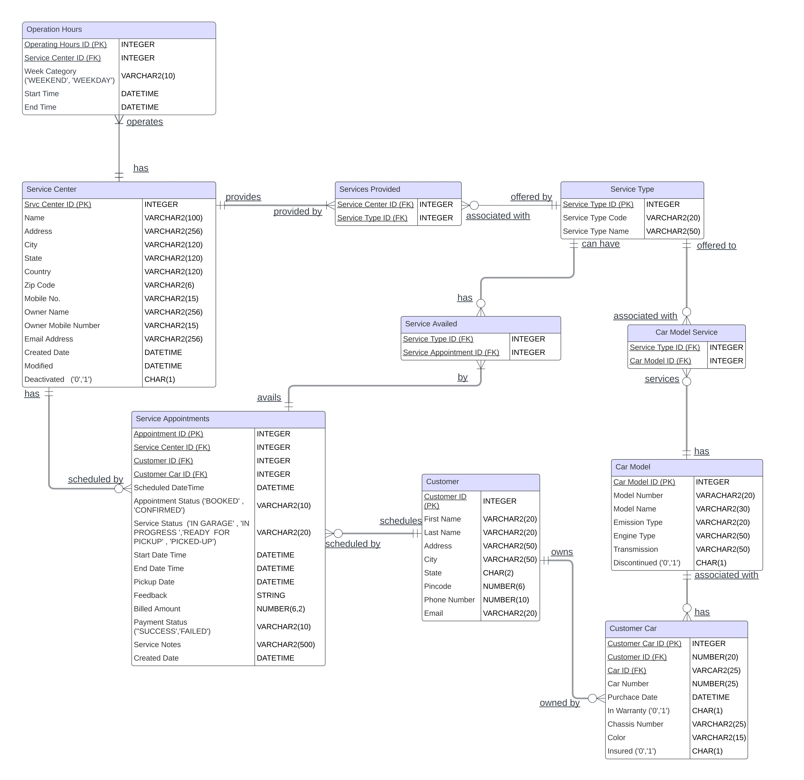

# Car Service Management Platform - Database Design and Architecture (Group Project)

### Business Context
Astar Technology Services (hypothetical company), provides innovative B2B technology solutions for car
companies, focusing on car servicing products. Car companies often encounter challenges in ensuring
their customers receive quality service, primarily due to the difficulties customers face in locating and
identifying authorized service centers.
Intended Solution
We offer a comprehensive B2B platform tailored for car companies, enabling them to register their
authorized service centers across different regions. Through our platform, companies can specify the car
models each center services and provide details about the service. This all-in-one solution consolidates
essential data about their service centers, including location, performance metrics, customer base,
satisfaction levels, and profitability.

Simultaneously, we provide a user-friendly B2C platform for car owners. This app allows them to register
their vehicles and locations, allowing them to find authorized service centers for their specific needs
easily. Additionally, the app enables tracking of services received.

### Entity Relatioship Diagram (E-R DIAGRAM)

### Queries to get data insights 
1. Get the total revenue generated by each center
`SELECT SA.ServiceCenterID, S.Name, SUM(SA.BilledAmount) AS Total_Revenue FROM ServiceCenter S, ServiceAppointment SA`
`WHERE SA.ServiceCenterID=S.ServiceCenterID` 
`GROUP BY SA.ServiceCenterID, S.Name` 
`ORDER BY 3 DESC`

2. Number of services provided by each service center
`SELECT SC.ServiceCenterID, SC.Name, COUNT(ST.ServiceTypeID) AS Number_Of_Services  
FROM ServiceCenter SC JOIN ServicesProvided SP 
ON SC.ServiceCenterID = SP.ServiceCenterID 
JOIN ServiceType ST ON ST.ServiceTypeID=SP.ServiceTypeID 
GROUP BY SC.ServiceCenterID, SC.Name 
ORDER BY Number_Of_Services DESC`

3. The most preferred time while booking an appointment
`SELECT EXTRACT(HOUR FROM ScheduledDateTime) AS Hour_Of_Day, 
COUNT(DISTINCT ServiceAppointmentID) AS Appointments 
FROM ServiceAppointment 
GROUP BY EXTRACT(HOUR FROM ScheduledDateTime) 
ORDER BY 2 DESC`

4. List of states having a customer count greater than 1
`SELECT State, COUNT(DISTINCT CustomerID) AS Number_Of_Customers 
FROM Customer 
GROUP BY State 
HAVING COUNT(DISTINCT CustomerID) > 1`

5. List of customers who did not schedule any appointment to date
`SELECT COUNT(DISTINCT CustomerID) AS Customers_Without_Appointments 
FROM ( 
    SELECT DISTINCT C.CustomerID, SA.ServiceAppointmentID 
    FROM Customer C LEFT JOIN ServiceAppointment SA 
    ON C.CustomerID=SA.CustomerID 
    WHERE SA.ServiceAppointmentID IS NULL)`

### Link to Oracle LiveQL
https://livesql.oracle.com/ords/livesql/s/b5w85zbzhe330kgssndi8etnf

(Some insert queries might be complex in structure due to some constraints in Oracle LiveSQL)
